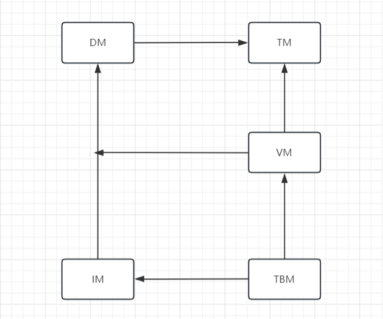

SimpleDB分为后端和前端，前后端通过socket进行交互。 

SimpleDB前端（客户端）的职责很简单：读取用户的输入，并发送到后端执行，输出返回结果，并且等待下一次输入。

SimpleDB后端则需要解析SQL，如果是合法的SQL，就尝试执行并且返回结果。不包括解析器，SimpleDB的后端划分为五个模块，
每个模块都有一定的职责，通过接口向其依赖的模块提供方法。
***
>五个模块如下：

1、Transaction Manager(TM)

2、Data Manager (DM)

3、Version Manager(VM)

4、Index Manager(IM)

5、Table Manager(TBM)

>五个模块的依赖改关系如下

从这个依赖图中， 
由拓扑排序，实现顺序为TM——>DM——>VM——>IM——>TBM

>每个模块的职责如下：

1、**TM** 
&nbsp;&nbsp;通过维护XID文件来维护事务的状态，并提供接口供其他模块来查询某个事务的状态。 
2、**DM** 
&nbsp;&nbsp;直接管理数据库DB文件和日志文件。DM的主要职责有：1）分页管理DB文件，并且进行缓存；2
）管理日志文件，保证在发送错误时可以根据日志进行恢复；3）抽象DB文件为DataItem供上层模块使用，并提供缓存。 
3、**VM** 
&nbsp;&nbsp;基于两段锁协议实现了调度序列的可串行化，并实现了MVCC以消除读写阻塞。同时实现了两种隔离级别。 
4、**IM** 
&nbsp;&nbsp;实现了基于B+树的索引，BTW，目前where只支持已索引字段。 
5、**TBM** 
&nbsp;&nbsp;实现了对字段和表的管理，同时，解析SQL语句，并根据语句操作表。 
